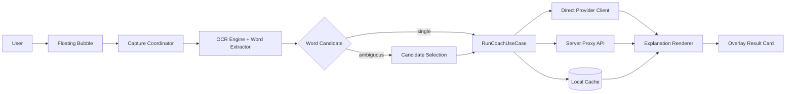

# AI 伴学英语单词背诵

> 一个面向真实学习场景的 Android 悬浮背词助手：看到单词即可截图识别、词源讲解、快速复习。

[](mobile/)
[](https://kotlinlang.org/)
[](https://github.com/foryourhealth111-pixel/ai-banxue-english-word-memorization/releases)
[](LICENSE)

## 项目为什么而生

很多人背单词的痛点并不是“没有资料”，而是“学习动作被打断”：

- 在文章、视频、社交媒体里看到生词时，切 App 查词会打断阅读流。
- 查到释义后仍记不住，缺少“词源 + 画面 + 场景”的深度解释。
- 复习节奏不稳定，知识没有形成长期记忆。

`AI 伴学英语单词背诵` 的目标是把“看到生词 -> 理解 -> 记住 -> 复习”压缩成一次顺手动作：悬浮球截图、自动识别、AI 结构化讲解、一键复制整理。

## 核心功能

| 功能 | 说明 |
|---|---|
| 悬浮球即时唤起 | 在任意界面点击悬浮球即可发起截图讲解，不强制切换应用。 |
| 截图 + OCR 识别 | 使用设备截图能力与 OCR 识别候选词，减少手动输入。 |
| 候选词歧义处理 | 候选不唯一时，支持用户二次选择后继续讲解。 |
| 结构化 AI 讲解 | 重点围绕词源、记忆技巧、生活场景、例句和复习提示输出。 |
| Markdown 展示优化 | 结果做清洗与渲染，提升阅读观感；复制时输出更适合做笔记。 |
| 本地缓存 | 命中缓存时更快返回，减少重复请求。 |
| 直连/代理双通路 | 可配置模型直连；失败时自动回退 server 代理。 |
| 国际化支持 | 已支持默认英文与简体中文资源。 |

## 什么情况下适合使用

- 阅读英文材料时遇到生词，需要“不中断”地快速理解。
- 想把单词记忆从“背释义”升级为“理解词源 + 场景化记忆”。
- 想在手机端形成稳定的高频复习闭环。
- 希望在可控安全策略下接入自己的模型服务（OpenAI 兼容接口）。

## 为什么选择这个项目

1. 它是为“学习体验”设计的，不是单纯 OCR Demo。
2. 讲解策略强调记忆效果，而不仅是翻译结果。
3. 支持独立运行（配置直连后可脱离本机 server）。
4. 架构清晰，前后端分层，便于二次开发和部署。
5. 安全边界明确：移动端不应硬编码提供商密钥。

## 快速开始

### 1. 环境要求

- JDK 17+
- Android Studio（建议最新稳定版）
- Android SDK Build Tools（建议 34.x）
- Node.js 20+（用于 server）

### 2. 启动后端（可选，作为代理）

```powershell
cd server
npm install
npm run dev
```

配置参考：`server/.env.example`

### 3. 启动 Android

在 Android Studio 打开 `mobile/`，运行 `app` 模块即可。

### 4. 直连模型（推荐独立运行）

在 App 的配置页填写：

- `Base URL`（OpenAI 兼容）
- `Model`
- `API Key`

填写后，设备优先直连提供商；直连失败自动回退 server 代理。

### 5. 生成可分发 Release APK（签名）

1. 复制 `mobile/keystore.properties.example` 为 `mobile/keystore.properties`
2. 填写签名参数（本地文件，已在 `.gitignore` 中忽略）
3. 执行构建：

```powershell
cd mobile
gradle :app:assembleRelease
```

已签名产物路径：

- `mobile/app/build/outputs/apk/release/app-release.apk`

## 架构设计



### 目录结构

- `mobile/` Android 客户端
  - `feature/overlay` 悬浮窗、交互卡片、状态展示
  - `feature/capture` 截图协调与 MediaProjection 会话管理
  - `feature/ocr` 文字识别与目标词提取
  - `feature/coach` 讲解请求与缓存策略
- `server/` 后端代理
  - Fastify 路由、鉴权、限流、请求日志
- `docs/` 设计文档、测试计划、发布记录

## 权限说明

| 权限 | 用途 | 是否必需 |
|---|---|---|
| `SYSTEM_ALERT_WINDOW` | 显示悬浮球与结果卡片 | 是 |
| `FOREGROUND_SERVICE` | 持续运行悬浮服务 | 是 |
| `FOREGROUND_SERVICE_MEDIA_PROJECTION` | 截图流程前台服务能力 | 是 |
| `INTERNET` | 请求模型服务或代理服务 | 是 |
| `POST_NOTIFICATIONS` | 前台服务提示通知 | Android 13+ 推荐 |

> 代码位置：`mobile/app/src/main/AndroidManifest.xml`

## 安全性与隐私

### 安全原则

- 默认不将真实提供商 API Key 固化在仓库代码中。
- `server/.env`、签名文件、keystore 配置均已忽略提交。
- 客户端通过 `CLIENT_TOKEN` 与代理服务进行基础鉴权。
- 服务端包含限流、防滥用和基础输入校验。

### 你需要注意

1. 不要把真实密钥提交到 Git 仓库。
2. 生产环境请更换强随机 `CLIENT_TOKEN`。
3. 如果公开部署 server，请开启 HTTPS 与更严格鉴权策略。
4. 发布版本请使用你自己的 keystore 并妥善备份。

## 发布与下载

- GitHub Releases：`https://github.com/foryourhealth111-pixel/ai-banxue-english-word-memorization/releases`

## 开源协议

本项目采用 [MIT License](LICENSE)。
